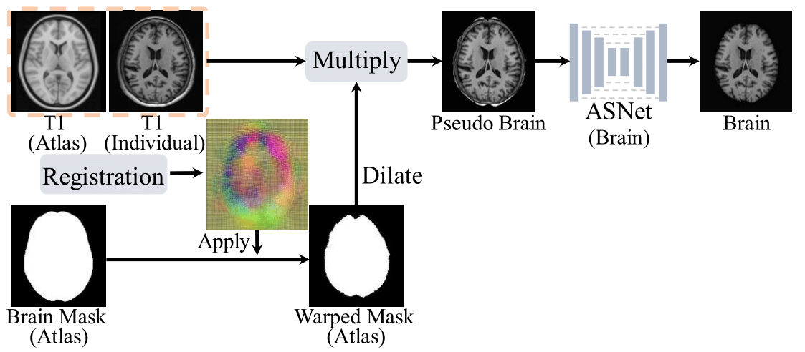

## Automatic Brain Skull-stripping (AutoStrip)
Repo for Architecture and Implementation Details of age- and contrast-agnostic, prior knowledge-guided automatic skull-stripping (**_AutoStrip_**) 
### [<font color=#F8B48F size=3>License</font> ](./LICENSE)
```
Copyright IDEA Lab, School of Biomedical Engineering, ShanghaiTech. Shanghai, China

Licensed under the the GPL (General Public License);
you may not use this file except in compliance with the License.
You may obtain a copy of the License at

    http://www.apache.org/licenses/LICENSE-2.0

Repo for Automatic Brain Skull-stripping (AutoStripping)
Contact: JiamengLiu.PRC@gmail.com
```

This work is a refined version of previously proposed brain extraction tool <https://github.com/SaberPRC/Auto-BET>

### Main Framework
In this work, we utilize the `prior-defined age-specific` brain atlas to eliminate the intensity contrast and field of view variations, to enabling `spatially-precise` and `longitudinally-consistent` brain skull-stripping, including two steps:

<div style="text-align: center">
  
</div>

1. `Redundant tissue removal`: Utilizing a series of age-specific brain atlas to propagate the predefined brain mask to generate pseudo brain mask to remove redundant non-brain tissues, such as those in the facial, neck, and shoulder regions, thus enhancing the robustness of brain extraction.

2. `Learning-based brain skull-stripping`: Utilizing the attention-driven, neighboring-aware segmentation network to effectively extract brain tissues from the masked pseudo-brain by utilizing comprehensive contextual information from larger-scale patches.

**Step 1**: Data Preparation
* Reformat data as following
    ```shell
    Experiments # Experiment results folder
    ├── csvfile # Folder to save training, validation and testing dataset 
    │   └── file_list.csv # Each line with [IDs, folder, fold]
    ├── data # Folder to save folder
    │   ├── HCPA # subfolder for individual data center
    │   │   └── sub001 # single subject
    │   │       ├── brain.nii.gz
    │   │       ├── persudo_brain.nii.gz
    │   │       ├── skull-strip.nii.gz
    │   │       └── T1.nii.gz
    │   ├── HCPD
    │   └── HCPY
    └── Results # Folder to save pretrained checkpoints and log info
        └── AutoStrip # Each folder with distinct training configuration
            ├── checkpoints
            ├── log
            │   └── log
            └── pred
    ```

**Step 2**: Persudo Brain Extraction
* Using predefined age-specific brain atlas to eliminate the redundant non-brain tissues
    ```shell
    python ./code/ACPC_Correction.py --input /path/to/ACPC/Corrected/T1w/Image --output /path/to/persudo/brain/path --RefImg /path/to/MNI/Atlas/with/Skull --RefSeg /path/to/MNI/brain/mask
    ```

**Step 3** Model Training
* For people without large GPU memory
    ```shell
    python ./code/AutoBET-Standard.py --model_path /path/to/pretrained/Standard/AutoBET/Model --input /path/to/persudo/brain/image --output_brain /path/to/save/brain --output_brain_mask /path/to/save/brain_mask
    ```

**Step 4** Brain Extraction (Fine)
* For people with large GPU memory
    ```shell
    python ./code/AutoBET-Fine.py --model_path /path/to/pretrained/Fine/AutoBET/Model --input /path/to/persudo/brain/image --output_brain /path/to/save/brain --output_brain_mask /path/to/save/brain_mask
    ```


