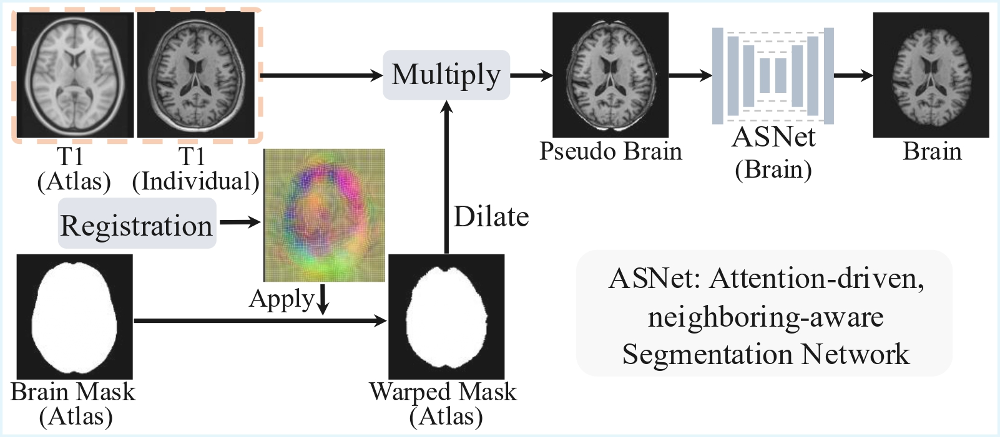

## Automatic Skull-strip Method (AutoStrip) for T1w MRI Data
Official implementation details of age- and contrast-agnostic, prior knowledge-guided automatic skull-stripping (**_AutoStrip_**) for T1w data across the lifespan. It's the brain extraction part for **BrainParc** framework.  

***
### Main Framework
As shown in the following figure, **AutoStrip** comprises two stages 

1. `Redundant tissue removal`: Utilizing a series of age-specific brain atlases to propagate the predefined brain mask to generate pseudo brain mask to remove redundant non-brain tissues, such as those in the facial, neck, and shoulder regions, thus enhancing the robustness of brain extraction.

2. `Learning-based brain skull-stripping`: Utilizing the attention-driven, neighboring-aware segmentation network to effectively extract brain tissues from the masked pseudo-brain by utilizing comprehensive contextual information from larger-scale patches.


<div style="text-align: center">
  
</div>

***
### Implementation and Model Training

**Step 1, Data Preparation**: To reproduce **AutoStrip** on your own data, please organize your data and project in the following format.

    ```shell
    Experiments # Experiment results folder
    ├── csvfile # Folder to save training, validation and testing dataset 
    │   └── file_list.csv # Each line with [IDs, folder, fold]
    ├── data # Folder to save folder
    │   ├── HCPA # subfolder for individual data center
    │   │   └── sub001 # single subject
    │   │       ├── brain.nii.gz # brain intensity without 
    │   │       ├── pseudo_brain.nii.gz # pseudo brain extracted from whole brain, refer to (./Code/Script/)
    │   │       ├── skull-strip.nii.gz
    │   │       └── T1.nii.gz
    │   ├── HCPD
    │   └── HCPY
    └── Results # Folder to save pretrained checkpoints and log info
        └── AutoStrip # Folder to save pretrained weight for AutoStrip and validation results for each checkpoint
            ├── checkpoints # Folder to save checkpoints for each epoch (we save checkpoints each 10 epoches)
            ├── log # Folder to save log info
            │   └── log
            └── pred # Folder to save validation results for each epoch 
    ```

#### **Note:** The relative training, testing, and validation split should be recorded in `file_list.csv`. The example for `file_list.csv` is shown below:

<div align="center" style="width:100%; margin:auto;">

<table style="width:80%; text-align:center; border-collapse:collapse;">
  <tr>
    <th>IDs</th>
    <th>folder</th>
    <th>fold</th>
  </tr>
  <tr><td>sub001</td><td>HCPY</td><td>1</td></tr>
  <tr><td>sub002</td><td>HCPY</td><td>2</td></tr>
  <tr><td>sub003</td><td>HCPY</td><td>3</td></tr>
  <tr><td>sub001</td><td>HCPD</td><td>1</td></tr>
  <tr><td>sub002</td><td>HCPD</td><td>2</td></tr>
  <tr><td>sub003</td><td>HCPD</td><td>3</td></tr>
  <tr><td>sub004</td><td>HCPD</td><td>3</td></tr>
  <tr><td>sub001</td><td>HCPA</td><td>3</td></tr>
</table>

</div>
where folder denote for different datasets and fold used for the training (fold=3), testing (fold=1), and validation (fold=2) split.

**Step 2, Model Training**: The following script is used to train the AutoStrip
```shell
python ./Code/train_AutoStrip.py --save_path AutoStrip --fold 1 --file_list file_list.csv --resume -1 --batch_size 2 --log_name bet_list --BE 1
```

***
### Inference Using Our Pretrained Model
We provide three samples in infant and two samples in child and adult for testing in folder: [Test_Sample](./Test_Sample). You are welcome to test our model on your own data by organizing your data in the following format:
```shell
Test_Sample
├── sub001_infant_infantile
│   └── T1.nii.gz
├── sub002_infant_isointense
│   └── T1.nii.gz
├── sub003_infant_adult_like
│   └── T1.nii.gz
├── sub004_child
│   └── T1.nii.gz
└── sub005_adult
    └── T1.nii.gz
```

1. Pseudo brain extraction 

    ```shell
    python ./Code/Inference/Step01_Pseudo_BrainExtraction.py --input ./Test_Sample/sub001_infant_infantile/T1.nii.gz --output ./Test_Sample/sub001_infant_infantile/pseudo_brain.nii.gz --RefImg ./Atlas/infantile/img-T1.nii.gz --RefSeg ./Atlas/infantile/seg-T1.nii.gz
    python ./Code/Inference/Step01_Pseudo_BrainExtraction.py --input ./Test_Sample/sub002_infant_isointense/T1.nii.gz --output ./Test_Sample/sub002_infant_isointense/pseudo_brain.nii.gz --RefImg ./Atlas/isointense/img-T1.nii.gz --RefSeg ./Atlas/isointense/seg-T1.nii.gz
    python ./Code/Inference/Step01_Pseudo_BrainExtraction.py --input ./Test_Sample/sub003_infant_adult_like/T1.nii.gz --output ./Test_Sample/sub003_infant_adult_like/pseudo_brain.nii.gz --RefImg ./Atlas/adult-like/img-T1.nii.gz --RefSeg ./Atlas/adult-like/seg-T1.nii.gz
    python ./Code/Inference/Step01_Pseudo_BrainExtraction.py --input ./Test_Sample/sub004_child/T1.nii.gz --output ./Test_Sample/sub004_child/pseudo_brain.nii.gz --RefImg ./Atlas/adult/img-T1.nii.gz --RefSeg ./Atlas/adult/seg-T1.nii.gz
    python ./Code/Inference/Step01_Pseudo_BrainExtraction.py --input ./Test_Sample/sub005_adult/T1.nii.gz --output ./Test_Sample/sub005_adult/pseudo_brain.nii.gz --RefImg ./Atlas/adult/img-T1.nii.gz --RefSeg ./Atlas/adult/seg-T1.nii.gz
    ```
   * --input: input data with skull
   * --output: pseudo brain save path
   * --RefImg: age-specific atlas image with skull
   * --RefSeg: corresponding atlas brain mask


2. Skull-stripping using AutoStrip
    ```shell
    python ./Code/Inference/Step02_AutoStrip_Skull_Stripping.py --model_path ./Pretrained_Model/AutoStrip_Full.pth.gz --input ./Test_Sample/sub001_infant_infantile/pseudo_brain.nii.gz --output_brain ./Test_Sample/sub001_infant_infantile/brain.nii.gz --output_brain_mask ./Test_Sample/sub001_infant_infantile/skull_strip.nii.gz --norm_orientation 0 --norm_spacing 0
    python ./Code/Inference/Step02_AutoStrip_Skull_Stripping.py --model_path ./Pretrained_Model/AutoStrip_Full.pth.gz --input ./Test_Sample/sub002_infant_isointense/pseudo_brain.nii.gz --output_brain ./Test_Sample/sub002_infant_isointense/brain.nii.gz --output_brain_mask ./Test_Sample/sub002_infant_isointense/skull_strip.nii.gz
    python ./Code/Inference/Step02_AutoStrip_Skull_Stripping.py --model_path ./Pretrained_Model/AutoStrip_Full.pth.gz --input ./Test_Sample/sub003_infant_adult_like/pseudo_brain.nii.gz --output_brain ./Test_Sample/sub003_infant_adult_like/brain.nii.gz --output_brain_mask ./Test_Sample/sub003_infant_adult_like/skull_strip.nii.gz
    python ./Code/Inference/Step02_AutoStrip_Skull_Stripping.py --model_path ./Pretrained_Model/AutoStrip_Full.pth.gz --input ./Test_Sample/sub004_child/pseudo_brain.nii.gz --output_brain ./Test_Sample/sub004_child/brain.nii.gz --output_brain_mask ./Test_Sample/sub004_child/skull_strip.nii.gz
    python ./Code/Inference/Step02_AutoStrip_Skull_Stripping.py --model_path ./Pretrained_Model/AutoStrip_Full.pth.gz --input ./Test_Sample/sub005_adult/pseudo_brain.nii.gz --output_brain ./Test_Sample/sub005_adult/brain.nii.gz --output_brain_mask ./Test_Sample/sub005_adult/skull_strip.nii.gz
    ```

   * --model_path: pretrained model path
   * --norm_orientation: set to 1 if your data orientation is not RPI 
   * --norm_spacing: set to 1 if your data is larger than 1 _mm_, or smaller than 0.5 _mm_
   * --standard_spacing: (1, 1, 1)
   * --input: path to pseudo_brain.nii.gz
   * --output_brain: path to skull stripped data
   * --output_brain_mask: path to brain mask
### Pretrained model

You can download our pretrained model through the following link:
* [AutoStrip Full](https://drive.google.com/file/d/1lQcN8wl1kOrPB6UTHC0XbcKSMDuQ4jdV/view?usp=sharing)


### [<font color=#F8B48F size=3>License</font> ](./LICENSE)
```
Copyright IDEA Lab, School of Biomedical Engineering, ShanghaiTech. Shanghai, China

Licensed under the the GPL (General Public License);
you may not use this file except in compliance with the License.
You may obtain a copy of the License at

    http://www.apache.org/licenses/LICENSE-2.0

Repo for Automatic Skull-stripping (AutoStrip)
Contact: JiamengLiu.PRC@gmail.com
```

